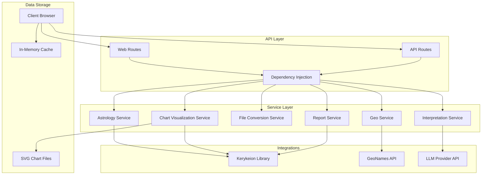
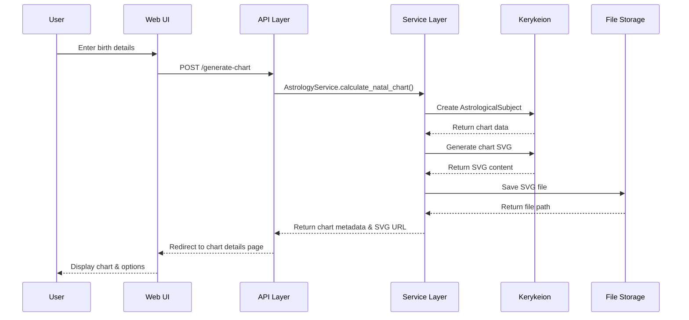
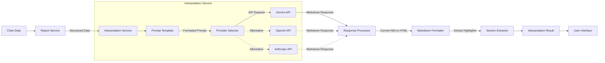

# Zodiac Engine - Presentation Outline

## 1. Introduction

*   **What is Zodiac Engine?**
    *   A comprehensive FastAPI web application for astrological chart generation, visualization, reporting, and AI-powered interpretations.
    *   Core engine: Kerykeion library.
    *   Focus: Responsive, user-friendly web interface.
*   **Project Goal:**
    *   To provide a modern, accessible platform for exploring astrological charts, enhanced with AI insights.
    *   Cater to both Western (Tropical) and Vedic (Sidereal) astrology enthusiasts.

---

## 2. Key Features & Demonstration Points

*   **Dual Astrological Systems:**
    *   Show the form allowing selection between Western and Vedic.
    *   Briefly mention the significance (different zodiacs).
*   **Chart Generation & Visualization:**
    *   Input sample birth data.
    *   Highlight the city lookup (GeoNames API).
    *   Show the generated SVG chart on the "Chart Details" page.
    *   Point out customization: themes, house systems.
*   **AI-Powered Interpretation:**
    *   This is the **core AI integration**.
    *   Click to generate an interpretation for the displayed chart.
    *   Explain that the LLM (e.g., Gemini) processes structured chart data.
    *   Show the formatted interpretation, highlights, and suggestions.
*   **Detailed Reports & Downloads:**
    *   Show the tabular ASCII report.
    *   Demonstrate downloading the chart (e.g., as PNG or PDF).
*   **Responsive Design (Mobile-First):**
    *   Briefly show or mention how the interface adapts to mobile (can use browser dev tools to simulate if needed, or refer to screenshots in the main README).
    *   Mention HTMX for a smooth, dynamic experience.

---

## 3. Technical Deep Dive 

### A. System Architecture

*   **Explanation:**
    *   **Client Interaction:** Users access via browser (Web UI or direct API).
    *   **API Layer:** FastAPI handles requests, uses dependency injection.
    *   **Service Layer:** Contains distinct services for each core function (astrology, visualization, AI interpretation, etc.), promoting modularity.
    *   **Integrations:** Connects to Kerykeion (astrology), GeoNames (location), LLMs (AI).
    *   **Storage:** Saves SVG charts to disk; uses in-memory cache for session data in the UI.
    *   This layered approach ensures clean separation of concerns and maintainability.

### B. Data Flow for Chart Generation (Simplified for Presentation)

*   **Explanation:**
    1.  User inputs data.
    2.  API receives request, passes to Service Layer.
    3.  Service Layer uses Kerykeion for calculations and SVG generation.
    4.  SVG is saved, metadata returned.
    5.  User is redirected to see the chart.

### C. AI Integration Architecture - The Core AI Feature!

*   **Explanation:** This is how we get from raw chart data to a human-readable AI interpretation.
    1.  **Data Prep:** We first generate a structured text report from the chart (planet positions, houses, etc.).
    2.  **Interpretation Service:**
        *   **Craft Prompt:** This report, along with user choices (like interpretation tone), is turned into a detailed prompt for the LLM.
        *   **Call LLM API:** We send the prompt to Google Gemini (or another configured LLM).
        *   **Process Response:** The LLM sends back a Markdown text.
        *   **Format Output:** We convert this Markdown to HTML for web display and extract key highlights/suggestions.
    3.  **Display:** The final interpretation is shown to the user dynamically.
    *   This process turns complex data into meaningful, personalized astrological insights.

---

## 4. Technologies Used 

*   **Backend:** Python, FastAPI, Pydantic, Uvicorn
*   **Astrology Core:** Kerykeion
*   **Frontend:** Jinja2, HTML, CSS, Bootstrap 5, HTMX
*   **AI:** Google Gemini API (adaptable to OpenAI, Anthropic)
*   **Image/File Handling:** CairoSVG, Pillow
*   **Geolocation:** GeoNames API
*   **Testing:** Pytest
*   **Key Python Libraries:** `requests-cache`, `python-dotenv`.

---

## 5. Challenges & Lessons Learned

*   **Challenge 1: SVG Preprocessing.**
    *   Kerykeion SVGs use CSS variables. These needed to be resolved (inlined) before conversion to PNG/PDF by CairoSVG.
    *   **Lesson:** Understanding library output intricacies is key for integration. Developed a custom regex-based solution.
*   **Challenge 2: Asynchronous Operations with Blocking Libraries.**
    *   FastAPI is async, but Kerykeion and some file operations are blocking.
    *   **Lesson:** Used FastAPI's `run_in_threadpool` and `BackgroundTasks` to prevent blocking the event loop, ensuring responsiveness.
*   **Challenge 3: Effective LLM Prompt Engineering.**
    *   Getting high-quality, structured interpretations from the LLM required careful prompt design and iteration.
    *   **Lesson:** Providing the LLM with well-structured data (our text reports) significantly improves output quality. Iterative refinement of prompts is crucial.
*   **Challenge 4: HTMX for Progressive Enhancement.**
    *   Ensuring the UI was functional without JavaScript but enhanced by HTMX required thoughtful template design (full pages vs. fragments).
    *   **Lesson:** HTMX is powerful for creating dynamic UIs with a simpler backend, but requires planning for different request types (`HX-Request` header).

---

## 6. Meeting Academic Requirements

*   **Technology:** Responsive web app (FastAPI, Bootstrap, HTMX) - **MET**.
*   **AI Integration:** LLM-powered chart interpretation (Google Gemini) - **MET**.
*   **Application Requirements:**
    *   3+ Screens (Home, Chart Details, Interpretation/Report views) - **MET**.
    *   Data Persistence (In-memory session cache for chart data, SVG files to disk) - **MET**.
    *   Mobile-First UX - **MET** (demonstrated or shown via screenshots).
*   **Deliverables:** GitHub Repo & comprehensive README.md - **MET**.

---

## 7. Future Improvements

*   Full Synastry, Composite, and Transit chart functionalities.
*   Persistent chart storage (e.g., SQLite).
*   Expanded AI: Synastry analysis, specific aspect interpretations.
*   User accounts and preferences.
