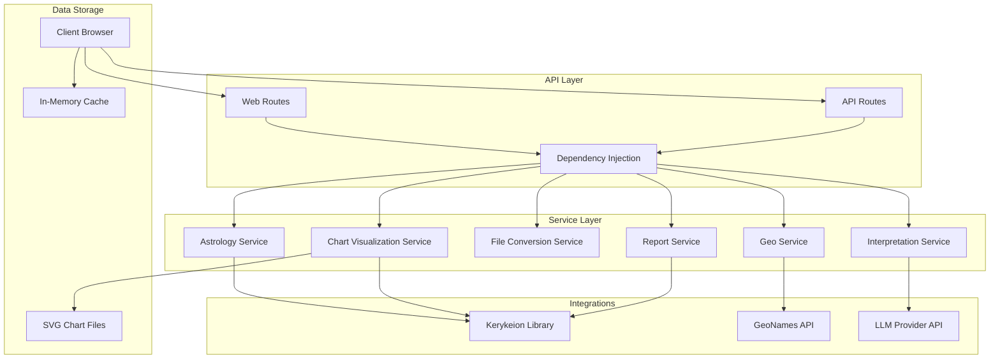
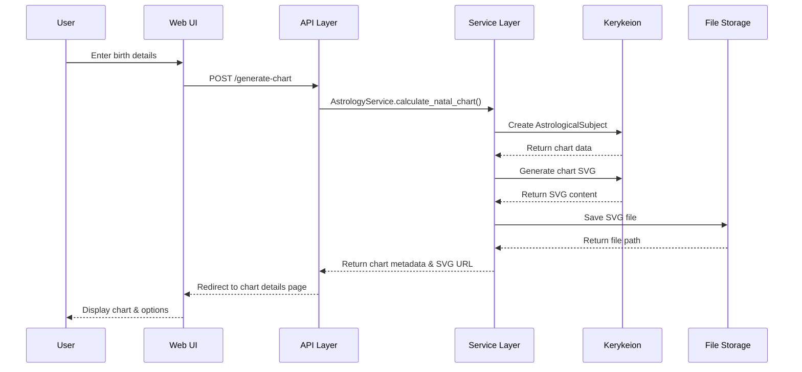
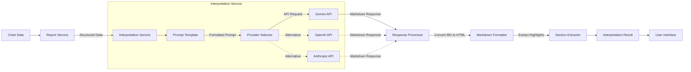

# Zodiac Engine

**Zodiac Engine is a comprehensive FastAPI web application designed for astrological chart generation, detailed visualization, insightful reporting, and AI-powered interpretations. It leverages the powerful Kerykeion library for its core astrological calculations and offers a responsive, user-friendly web interface.**

## Table of Contents
- [Project Description](#project-description)
- [Architecture Overview](#architecture-overview)
- [Features](#features)
- [Technologies Used](#technologies-used)
- [AI Integration](#ai-integration)
- [Web Interface & User Experience](#web-interface--user-experience)
- [Mobile-First Design](#mobile-first-design)
- [Getting Started](#getting-started)
  - [Prerequisites](#prerequisites)
  - [System Dependencies](#system-dependencies)
  - [Installation](#installation)
  - [Configuration (.env)](#configuration-env)
  - [Running the Application](#running-the-application)
  - [Troubleshooting](#troubleshooting)
- [Data Persistence](#data-persistence)
- [API Overview](#api-overview)
- [Testing](#testing)
  - [Automated Tests](#automated-tests)
  - [Manual Test Scripts](#manual-test-scripts)
- [Project Structure](#project-structure)
- [Challenges and Lessons Learned](#challenges-and-lessons-learned)
- [Future Improvements](#future-improvements)
- [Academic Project Requirements](#academic-project-requirements)
- [License](#license)

## Architecture Overview

### System Architecture

The Zodiac Engine follows a layered architecture with clear separation of concerns:



**What You're Seeing:**

This architecture diagram shows the four main layers of our application:

1. **Client Interaction Layer**: The user interacts with our application through their browser, accessing either web routes (for the UI) or API routes (for direct data access).

2. **API Layer**: All requests flow through our FastAPI routers and use dependency injection to access services. This creates a clean separation between routing logic and business logic.

3. **Service Layer**: The core of our application contains six specialized services:
   - **Astrology Service**: Handles core astrological calculations
   - **Chart Visualization Service**: Generates SVG chart visualizations
   - **File Conversion Service**: Converts SVG to other formats (PNG, PDF, JPEG)
   - **Report Service**: Generates textual reports of chart data
   - **Interpretation Service**: Interfaces with LLMs for chart interpretation
   - **Geo Service**: Manages location searches and coordinates

4. **Integrations & Storage**: Our services connect to:
   - **Kerykeion**: The astrological calculation engine
   - **GeoNames API**: For location lookup
   - **LLM APIs**: For AI-powered interpretations
   - **Storage**: SVG files and in-memory cache

This architecture ensures each component has a single responsibility and allows for easy extension or replacement of individual services.

### Data Flow for Chart Generation



**What You're Seeing:**

This sequence diagram illustrates the complete flow of generating an astrological chart:

1. **User Input**: The process begins when a user enters birth details (name, date, time, location) and chart preferences in the web interface.

2. **Request Processing**:
   - The form data is submitted to our API
   - The API layer validates the input and passes it to the Astrology Service
   - The service creates an AstrologicalSubject using the Kerykeion library
   - Kerykeion performs the complex astrological calculations and returns structured chart data

3. **Chart Visualization**:
   - The service requests an SVG visualization from Kerykeion
   - The generated SVG is saved to the filesystem with a unique ID
   - The file path/URL is returned for future reference

4. **Response & Display**:
   - The API redirects the user to the chart details page
   - The web UI displays the chart with options for interpretation, reports, and downloads

This flow demonstrates how we handle the entire process from user input to displaying results, with clean separation between the UI, API, services, and external libraries.

### AI Integration Architecture



**What You're Seeing:**

This flowchart details our AI integration process, which is the standout feature of this application:

1. **Data Preparation**:
   - We start with calculated chart data from the previous flow
   - The Report Service formats this data into structured, human-readable tables (positions of planets, houses, etc.)
   - This structured data becomes the foundation for AI interpretation

2. **Interpretation Service Pipeline**:
   - **Prompt Template**: We craft customized prompts based on user preferences (focus areas, tone, length)
   - **Provider Selector**: Our system can work with multiple LLM providers (Gemini, OpenAI, Anthropic)
   - **API Request**: The formatted prompt is sent to the selected LLM API

3. **Response Processing**:
   - The LLM returns a detailed interpretation in Markdown format
   - Our Processor handles the response and manages potential API errors
   - The Markdown is converted to HTML for proper display
   - Key highlights and suggestions are extracted into separate sections

4. **User Presentation**: 
   - The formatted interpretation is displayed to the user through HTMX without a page reload
   - Users can print, download, or share their interpretation

This architecture demonstrates our sophisticated AI integration, going beyond simple API calls to create a robust processing pipeline that enhances the user experience with high-quality, formatted interpretations.

## Project Description

The Zodiac Engine aims to provide a modern, accessible platform for exploring astrological charts. Users can generate detailed natal charts (both Western Tropical and Vedic Sidereal systems) by providing birth information. The application then renders a high-quality SVG visualization of the chart, offers downloadable reports, and integrates with Large Language Models (LLMs) like Google Gemini or OpenAI's GPT to provide natural language interpretations of the astrological data.

The project emphasizes a responsive web experience, making it accessible on both desktop and mobile devices, and is built with a robust FastAPI backend ensuring scalability and maintainability.

## Features

*   **Dual Astrological Systems:** Supports both Western (Tropical) and Vedic (Sidereal) chart calculations.
*   **Comprehensive Natal Chart Data:** Calculates planetary positions, house cusps, and aspects.
*   **Highly Customizable SVG Chart Visualization:**
    *   Multiple themes (e.g., Classic, Dark, Pastel).
    *   Various house systems (e.g., Placidus, Whole Sign, Koch).
    *   Support for multiple languages in chart labels.
    *   Configurable active celestial points and aspects.
*   **AI-Powered Chart Interpretation:**
    *   Generates natural language interpretations of natal charts using LLMs (Google Gemini, OpenAI GPT, Anthropic Claude).
    *   Users can customize the focus (planets, houses, aspects), tone, and length of interpretations.
*   **Detailed Chart Reports:**
    *   Generates structured ASCII-based tabular reports for easy reading and for use as LLM input.
*   **Geolocation Integration:**
    *   City search feature using GeoNames API to accurately determine birth coordinates and timezone.
*   **Multiple Download Formats:**
    *   Charts can be downloaded as SVG, PNG, PDF, or JPG.
    *   Reports can be downloaded as plain text files.
*   **Responsive Web Interface:**
    *   Built with Jinja2, Bootstrap 5, and HTMX for a dynamic, mobile-first user experience.
    *   Intuitive form for chart generation and interactive display of results.
*   **Robust API Endpoints:**
    *   Well-documented RESTful API for all core functionalities (chart calculation, visualization, reporting, interpretation).
*   **Background Task Processing:**
    *   SVG chart generation is handled by background tasks to ensure a non-blocking UX.
*   **Extensible Design:**
    *   Structured to easily incorporate future features like synastry, composite charts, and transit analysis.

## Technologies Used

*   **Backend Framework:** Python 3.x, FastAPI
*   **Data Validation & Settings:** Pydantic
*   **ASGI Server:** Uvicorn
*   **Astrology Core:** Kerykeion library
*   **Frontend Templating:** Jinja2
*   **Frontend Styling & UI:** HTML5, CSS3, Bootstrap 5
*   **Frontend Interactivity:** HTMX (for progressive enhancement)
*   **AI Integration:**
    *   Google Gemini API (via `google-generativeai` SDK)
    *   (Support for OpenAI, Anthropic via their respective Python SDKs can be easily added to `InterpretationService`)
*   **Image Processing:**
    *   CairoSVG (SVG to PNG/PDF conversion)
    *   Pillow (PIL) (PNG to JPG conversion)
*   **Geolocation Service:** GeoNames API
*   **API Caching:** Requests-Cache (for GeoNames API calls)
*   **Data Persistence (Session):** In-memory Python dictionary (`chart_cache` in `app/api/web.py`) for temporary storage of generated chart metadata for the web UI.
*   **Testing:** Pytest, FastAPI `TestClient`
*   **Development & Tooling:** Git, GitHub, Python `venv`
*   **CI/CD:** GitHub Actions for Semantic Release

## AI Integration

Zodiac Engine integrates AI to provide users with natural language interpretations of their astrological charts. This feature enhances the user experience by translating complex astrological data into understandable insights.

*   **AI Feature:** Natal Chart Interpretation (Synastry interpretation is planned).
*   **Primary LLM Provider:** Google Gemini (e.g., `gemini-pro` model). The system is designed to be adaptable to other providers like OpenAI (GPT models) or Anthropic (Claude models) by modifying the `InterpretationService`.
*   **How it Works:**
    1.  The user generates a natal chart through the web interface.
    2.  Upon requesting an interpretation, the backend (via `ReportService`) generates a detailed, structured textual report of the chart using Kerykeion. This report includes tables for birth data, planet positions (sign, degrees, house), and house cusp positions.
    3.  This structured report, along with user preferences (focus areas, tone, length), is programmatically formatted into a comprehensive prompt for the LLM.
    4.  The `InterpretationService` sends this prompt to the configured LLM API (e.g., Google Gemini).
    5.  The LLM processes the astrological data and returns a detailed interpretation in Markdown format.
    6.  The backend converts the Markdown response to HTML and extracts key highlights and suggestions.
    7.  This enriched interpretation is then displayed dynamically to the user within the chart details page.
*   **Key Modules:**
    *   `app/services/interpretation.py`: Contains the logic for interacting with the LLM and crafting prompts.
    *   `app/services/report.py`: Generates the structured data fed to the LLM.
    *   `app/core/config.py` and `.env` file: Manage API keys and LLM provider settings.

This AI integration transforms raw astrological data into personalized narratives, making astrology more accessible and engaging.

## Web Interface & User Experience

The Zodiac Engine features a clean, responsive web interface designed with a mobile-first approach using Bootstrap 5. Key aspects include:

*   **Home Page (`/home`):** A straightforward form allows users to input birth details for either Western (Tropical) or Vedic (Sidereal) charts. It includes a city lookup feature powered by HTMX and the GeoNames API.
*   **Chart Details Page (`/chart/{chart_id}`):**
    *   Displays the generated SVG astrological chart.
    *   Provides options to download the chart in SVG, PNG, PDF, or JPG formats.
    *   Allows users to view a detailed tabular report of the chart.
    *   Features a section for AI-powered chart interpretation, with customizable options for focus, tone, and length.
*   **Progressive Enhancement with HTMX:** HTMX is used to load reports and AI interpretations dynamically without full page reloads, creating a smoother and faster user experience.
*   **Session Data:** Generated chart metadata (name, birth details, chart ID) is temporarily stored in an in-memory cache (`chart_cache`) for the current user session, allowing them to navigate to the chart details page and interact with it.

## Mobile-First Design

Zodiac Engine is designed with a strong focus on mobile usability:

* **Responsive Layout:** The application uses Bootstrap 5's grid system to automatically adjust to different screen sizes, from mobile phones to tablets and desktop computers.
* **Touch-Friendly Interface:** All interactive elements are sized appropriately for touch input, with sufficient spacing between clickable items.
* **Progressive Loading:** HTMX is used to load content progressively, optimizing performance on mobile devices.
* **Optimized Forms:** Input forms are designed for easy use on mobile touchscreens, with appropriate keyboard types for different inputs.
* **Mobile Navigation:** The interface uses a simplified navigation pattern that works well on small screens.

**Mobile UI Screenshots:**

[Screenshot: Home page on mobile]
[Screenshot: Chart generation form on mobile]

[Screenshot: Chart details view on mobile]
[Screenshot: AI interpretation on mobile]

## Getting Started

### Prerequisites

*   Python 3.10 or newer
*   Git
*   A **GeoNames username** (free account from [geonames.org/login](http://www.geonames.org/login)) for full city lookup functionality.
*   An **LLM API Key** from your chosen provider (e.g., Google Gemini API Key from [Google AI Studio](https://aistudio.google.com/app/apikey)) for the AI interpretation feature.

### System Dependencies

Some components require system-level libraries:

* **CairoSVG Dependencies:** (Required for SVG conversion)
  * On Ubuntu/Debian: `sudo apt-get install libcairo2-dev libpango1.0-dev libgdk-pixbuf2.0-dev libffi-dev shared-mime-info`
  * On macOS: `brew install cairo pango gdk-pixbuf libffi shared-mime-info`
  * On Windows: Consider using WSL or refer to the CairoSVG documentation

### Installation

1.  **Clone the repository:**
    ```bash
    git clone https://github.com/yourusername/zodiac-engine.git # Replace with your actual repo URL
    cd zodiac-engine
    ```

2.  **Create and activate a Python virtual environment:**
    ```bash
    python -m venv venv
    ```
    *   On macOS/Linux: `source venv/bin/activate`
    *   On Windows: `venv\Scripts\activate`

3.  **Install dependencies:**
    ```bash
    pip install -r requirements.txt
    ```

### Configuration (`.env`)

Create a `.env` file in the project's root directory. You can copy the example below.

```dotenv
# .env
PROJECT_NAME="Zodiac Engine"
VERSION="1.0.0" # This can be dynamic if using semantic-release effectively
API_V1_STR="/api/v1"
ALLOWED_ORIGINS="http://localhost:8000,http://127.0.0.1:8000"

# Kerykeion settings - Required for full city/timezone lookup
GEONAMES_USERNAME="your_geonames_username" # Replace with your GeoNames username

# LLM API settings for chart interpretations
LLM_PROVIDER="gemini"  # Default is gemini. Options: "openai", "anthropic", "gemini"
LLM_API_KEY="your_llm_api_key" # Replace with your API key for the chosen provider
LLM_MODEL_NAME="gemini-pro"  # e.g., "gemini-pro", "gpt-4", "claude-3-opus-20240229"
LLM_MAX_TOKENS=2000
LLM_TEMPERATURE=0.7
LLM_CACHE_ENABLED=true
LLM_CACHE_TTL_HOURS=24
```

**Important:**
*   Replace `"your_geonames_username"` with your actual GeoNames username.
*   Set `LLM_PROVIDER` to your chosen service (`gemini`, `openai`, or `anthropic`).
*   Replace `"your_llm_api_key"` with the corresponding API key.
*   Set `LLM_MODEL_NAME` to a model compatible with your chosen provider.

### Running the Application

Ensure your virtual environment is activated.

```bash
uvicorn app.main:app --reload
```

The application will be accessible at:
*   **Web Interface**: [http://127.0.0.1:8000/home](http://127.0.0.1:8000/home)
*   **API Docs (Swagger UI)**: [http://127.0.0.1:8000/docs](http://127.0.0.1:8000/docs)
*   **API Docs (ReDoc)**: [http://127.0.0.1:8000/redoc](http://127.0.0.1:8000/redoc)

### Troubleshooting

* **SVG Conversion Issues:** If you encounter problems with CairoSVG, ensure all system dependencies are installed and that your Python environment has access to them.
* **Geonames API Issues:** Verify your Geonames username is correctly set in the `.env` file. Note there are usage limits for free accounts.
* **LLM API Connection:** If chart interpretations fail, check your API key, internet connection, and ensure your chosen model is available from your provider.
* **Pytest Import Errors:** If you encounter naming conflicts in tests, check for duplicate test file names in different directories.

## Data Persistence

Zodiac Engine implements persistence in several ways:

* **Chart Metadata Cache:** Generated chart information is stored in an in-memory dictionary (`chart_cache`) during the user's session. This allows users to navigate between pages while maintaining access to their chart data.
* **Generated SVG Files:** Chart SVG files are physically saved to the filesystem in `app/static/images/svg/` with unique IDs, allowing for later retrieval.
* **Interpretation Cache:** (When enabled via `LLM_CACHE_ENABLED=true`) LLM-generated interpretations can be cached to reduce API costs and improve performance.

Future implementations will include SQLite database integration for more robust persistence across server restarts.

## API Overview

Zodiac Engine provides a RESTful API for astrological functionalities. Key endpoints include:

*   **Natal Chart Calculation:** `POST /api/v1/charts/natal/`
*   **Chart Visualization (SVG):**
    *   Natal: `POST /api/v1/charts/visualization/natal`
    *   Synastry: `POST /api/v1/charts/visualization/synastry`
*   **Chart Reports (Text-based):**
    *   Natal: `POST /api/v1/charts/reports/natal/`
    *   Synastry: `POST /api/v1/charts/reports/synastry/`
*   **AI-Powered Interpretations:**
    *   Natal: `POST /api/v1/charts/interpretations/natal/`
*   **Geolocation Search:** `GET /api/v1/geo/search`

Placeholders exist for `composite` and `transit` chart functionalities. The API is self-documenting via OpenAPI (Swagger UI at `/docs` and ReDoc at `/redoc`).

## Testing

### Automated Tests
The project uses `pytest` for automated testing. Tests cover API endpoints, service logic, and utility functions.

To run the tests:
```bash
# Ensure virtual environment is active and dependencies installed
pytest
```
Test files are located in the `tests/` directory.

### Manual Test Scripts
The `scripts/` directory contains shell scripts for manually testing API endpoints using `curl`:
*   `scripts/test_western_chart.sh`: Tests Western (Tropical) chart generation.
*   `scripts/test_vedic_chart.sh`: Tests Vedic (Sidereal) chart generation.

To run them (after starting the application):
```bash
bash scripts/test_western_chart.sh
```

## Project Structure

The codebase is organized into the following main directories:

*   `app/`: Main application package.
    *   `api/`: API endpoint definitions, structured by version and resource.
        *   `v1/`: Version 1 of the API.
            *   `routers/`: Routers for different API resources (charts, geo).
    *   `core/`: Core application components (config, dependencies, error handling, custom exceptions).
    *   `schemas/`: Pydantic models for data validation and serialization.
    *   `services/`: Business logic for different functionalities (astrology, visualization, interpretation, etc.).
    *   `static/`: Static files (CSS, generated SVG images).
    *   `templates/`: Jinja2 HTML templates for the web interface.
    *   `main.py`: FastAPI application entry point.
*   `scripts/`: Utility and test scripts.
*   `tests/`: Automated tests using Pytest.
*   `.github/workflows/`: GitHub Actions workflows (e.g., semantic-release).
*   `.cursor/rules/`: (If using Cursor IDE) Project-specific documentation and coding rules.

## Challenges and Lessons Learned

Throughout the development of Zodiac Engine, several challenges were encountered and valuable lessons learned:

* **SVG Processing:** Handling CSS variables in SVG files required custom preprocessing before conversion to other formats. We developed a regex-based solution to resolve CSS variables, ensuring compatibility with CairoSVG.

* **Asynchronous Pattern Consistency:** Balancing async and sync code when integrating with blocking libraries like Kerykeion required careful threading management using `run_in_threadpool` for performance optimization.

* **LLM Integration Complexity:** Crafting effective prompts for LLMs to interpret astrological data required multiple iterations to achieve useful outputs. The structured Report format proved essential for providing LLMs with sufficient context.

* **Progressive Enhancement with HTMX:** Implementing HTMX for a smoother user experience while maintaining functionality without JavaScript required careful planning of partial templates and response handling.

* **House System Mapping:** Reconciling differences between human-readable house system names and Kerykeion's internal codes required additional mapping logic and comprehensive error handling.

These challenges led to a more robust application architecture with better error handling, thoughtful abstraction layers, and improved user experience.

## Academic Project Requirements

This project fulfills the academic requirements as follows:

1. **Technology**: 
   - Built as a mobile-responsive web application using FastAPI, Bootstrap 5, and HTMX
   - Functions well on mobile devices with touch-friendly UI and responsive layout

2. **AI Integration**:
   - Integrates with Google's Gemini API for chart interpretations
   - Includes configuration for other AI providers (OpenAI, Anthropic)
   - Uses structured prompts to generate personalized astrological insights

3. **Application Requirements**:
   - **Multiple Screens**: Home/chart generation page, chart details page, and interpretation/report view
   - **Data Persistence**: Stores chart metadata in memory, saves SVG files to filesystem
   - **Mobile-First UX**: Responsive design with Bootstrap, touch-friendly elements, and HTMX for smooth interactions

4. **Deliverables**:
   - **GitHub Repository**: Complete codebase with documentation
   - **Comprehensive README.md**: Includes app description, technologies, AI integration details, and setup instructions
   - **Presentation Materials**: Demonstration flow highlighting key features and AI integration

## Future Improvements

*   **Full Synastry, Composite, and Transit Charts:** Implement complete calculation, reporting, and interpretation for these chart types.
*   **Persistent Chart Storage:** Replace the in-memory `chart_cache` with a lightweight database (e.g., SQLite or TinyDB) to allow users to save and revisit their charts.
*   **Expanded AI Capabilities:**
    *   AI-powered synastry relationship analysis.
    *   Interpretation of specific aspects or chart patterns (e.g., "What does my Mars square Pluto mean?").
    *   Support for more LLM providers (OpenAI, Anthropic are partially set up in `InterpretationService`).
*   **Advanced Astrological Features:** Incorporate asteroids, fixed stars, Arabic parts, midpoints, and other advanced astrological elements.
*   **User Accounts & Preferences:** Allow users to create accounts to save charts, preferences (default house system, theme), and view history.
*   **Interactive Chart Elements:** Make SVG charts more interactive (e.g., hover tooltips for planets, clickable elements).
*   **Enhanced UI/UX:** Further refine the user interface based on user feedback.
*   **Deployment Configuration:** Add instructions and configurations for deploying to platforms like Docker, Heroku, or AWS.

## License

[MIT License](LICENSE) (Assuming you'll add an MIT License file. If not, adjust accordingly, e.g., "This project is for educational purposes and is not licensed for redistribution without permission.")
