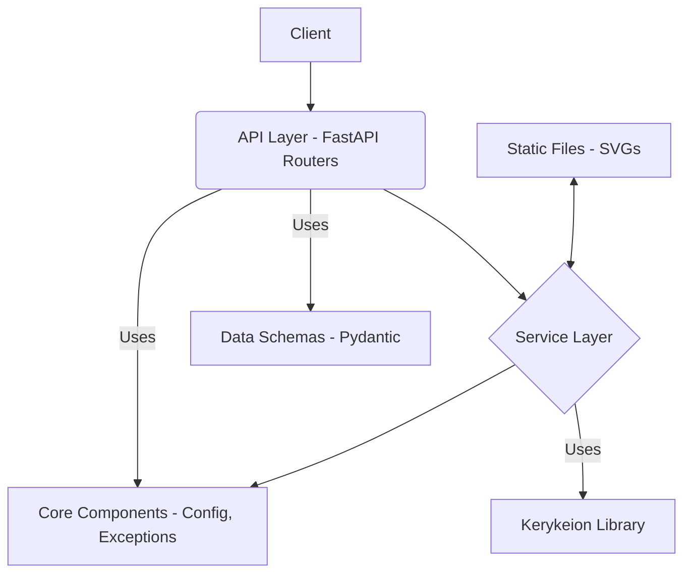

# System Patterns: Zodiac Engine

## 1. Architecture Overview

Zodiac Engine follows a standard layered architecture for a FastAPI web service:

- **API Layer**: Handles HTTP requests/responses, data validation (Pydantic), and routing.
  - Located in `app/api/`
  - Organized by version (`v1`) and resource (`charts`).
  - Uses FastAPI's `APIRouter` for modularity.
- **Service Layer**: Contains the core business logic, interacting with external libraries (Kerykeion) and orchestrating tasks.
  - Located in `app/services/`
  - `AstrologyService`: Handles core calculations.
  - `ChartVisualizationService`: Handles SVG generation and file management.
- **Core Layer**: Provides shared utilities, configuration, custom exceptions, and dependency injection setup.
  - Located in `app/core/`
- **Data Layer (Implicit)**: Currently relies on Kerykeion for data persistence/retrieval. No dedicated database layer implemented yet.
- **Static Files**: Serves generated SVG images.
  - Located in `app/static/`

## 2. Key Technical Decisions

- **Framework**: FastAPI for its performance, async capabilities, automatic documentation, and Pydantic integration.
- **Astrology Engine**: Kerykeion library for its comprehensive calculation features and SVG generation.
- **Data Validation**: Pydantic for request/response validation and API schema generation.
- **Dependency Management**: `requirements.txt` (Potential improvement: move to Poetry or similar).
- **Testing**: Pytest with `pytest-asyncio` and `TestClient`.
- **API Structure**: Versioned API (`/api/v1/`) with resource-based routing (currently `/endpoints/`, planned move to `/routers/`).

## 3. Design Patterns

- **Layered Architecture**: Separation of concerns between API, Service, and Core layers.
- **Dependency Injection**: Used for injecting settings (`app.core.dependencies`). Planned extension to services.
- **Repository Pattern (Implicit via Kerykeion)**: Kerykeion acts as the interface to astrological data/calculations.
- **Factory Pattern (App Creation)**: `create_application` function in `app/main.py`.
- **Configuration Management**: Centralized settings using `pydantic-settings` (`app.core.config`).

## 4. Critical Implementation Paths

- **Natal Chart Calculation**: `Client -> API (/natal) -> AstrologyService.calculate_natal_chart -> Kerykeion -> Response`
- **Natal Chart Visualization**: `Client -> API (/visualization/natal) -> ChartVisualizationService.generate_natal_chart_svg -> KerykeionChartSVG -> Save SVG -> Response (URL)`
- **Synastry Visualization**: Similar path involving two `AstrologicalSubject` instances.

## 5. Planned Improvements

- **Refactor API Structure**: Move from `endpoints/` to `routers/` as per `docs/api-structure-migration-plan.md`.
- **Service Layer DI**: Inject services as dependencies instead of using static methods.
- **Async Usage**: Review and ensure `async` is used appropriately only for I/O-bound operations. 