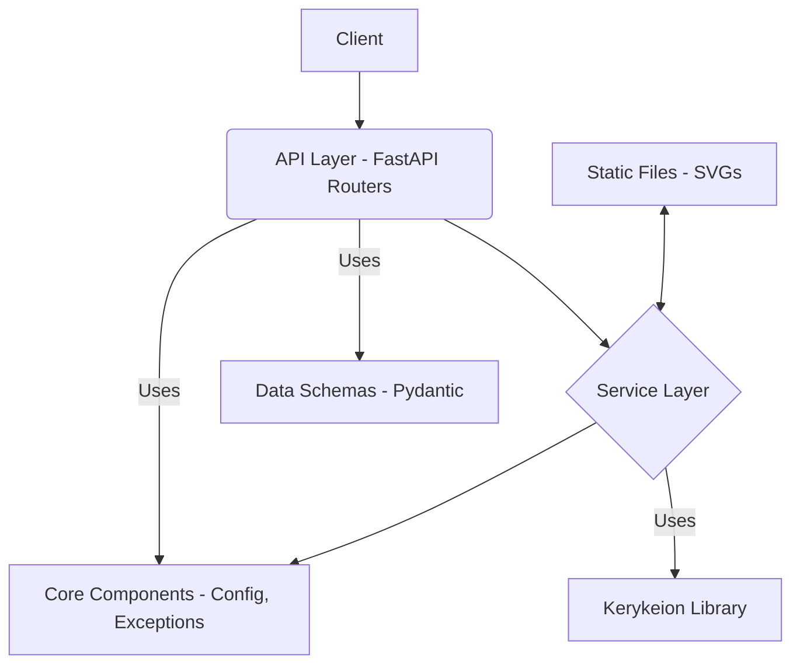

# System Patterns: Zodiac Engine

## 1. Architecture Overview

Zodiac Engine follows a standard layered architecture for a FastAPI web service:

- **API Layer**: Handles HTTP requests/responses, data validation (Pydantic), and routing.
  - Located in `app/api/`
  - Organized by version (`v1`) and resource (`charts`).
  - Uses FastAPI's `APIRouter` for modularity.
  - Follows modern `routers/` convention for better organization.
- **Service Layer**: Contains the core business logic, interacting with external libraries (Kerykeion) and orchestrating tasks.
  - Located in `app/services/`
  - `AstrologyService`: Handles core calculations.
  - `ChartVisualizationService`: Handles SVG generation and file management.
  - Uses instance methods with proper dependency injection.
- **Core Layer**: Provides shared utilities, configuration, custom exceptions, and dependency injection setup.
  - Located in `app/core/`
  - Uses modern Pydantic v2 syntax for settings.
  - Provides factory functions for dependency injection.
- **Data Layer (Implicit)**: Currently relies on Kerykeion for data persistence/retrieval. No dedicated database layer implemented yet.
- **Static Files**: Serves generated SVG images.
  - Located in `app/static/`

## 2. Key Technical Decisions

- **Framework**: FastAPI for its performance, async capabilities, automatic documentation, and Pydantic integration.
- **Astrology Engine**: Kerykeion library for its comprehensive calculation features and SVG generation.
- **Data Validation**: Pydantic v2 for request/response validation and API schema generation.
- **Dependency Management**: `requirements.txt` with explicit version constraints.
- **Testing**: Pytest with `pytest-asyncio` and `TestClient`.
- **API Structure**: Versioned API (`/api/v1/`) with resource-based routing using modern `/routers/` convention.
- **Environment Configuration**: Configuration through .env files, with proper parsing in Settings class.

## 3. Design Patterns

- **Layered Architecture**: Separation of concerns between API, Service, and Core layers.
- **Modern Dependency Injection**: Used throughout the application with Annotated type hints and factory functions.
- **Repository Pattern (Implicit via Kerykeion)**: Kerykeion acts as the interface to astrological data/calculations.
- **Factory Pattern (App Creation)**: `create_application` function in `app/main.py`.
- **Configuration Management**: Centralized settings using `pydantic-settings` (`app.core.config`) with property methods for type conversion.
- **Service Instance Pattern**: Services implemented as instance methods instead of static methods, enabling better testability and dependency injection.
- **Background Tasks**: Long-running operations handled via FastAPI's background tasks.

## 4. Critical Implementation Paths

- **Natal Chart Calculation**: `Client -> API (/natal) -> AstrologyService.calculate_natal_chart -> Kerykeion -> Response`
- **Natal Chart Visualization**: `Client -> API (/visualization/natal) -> ChartVisualizationService.generate_natal_chart_svg -> KerykeionChartSVG -> Save SVG -> Response (URL)`
- **Synastry Visualization**: Similar path involving two `AstrologicalSubject` instances.
- **Factory-based Dependency Injection**: `Depends(get_service) -> service instance -> service method -> result`

## 5. Planned Improvements

- **Database Integration**: Add a database layer for storing user data, generated chart metadata, or caching results.
- **Authentication/Authorization**: Implement if user-specific features are needed.
- **LLM Integration**: Add AI-powered interpretations for chart readings.
- **Advanced Caching**: Implement more sophisticated caching strategies for improved performance. 