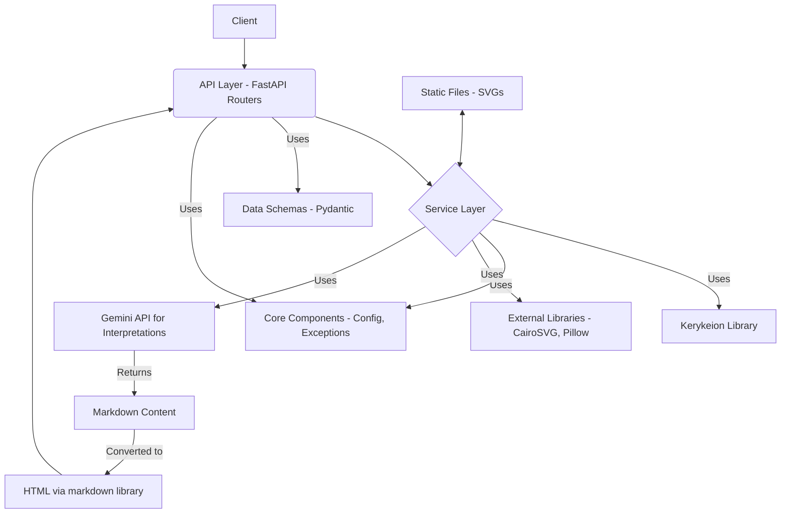

# System Patterns: Zodiac Engine

## 1. Architecture Overview

Zodiac Engine follows a standard layered architecture for a FastAPI web service:

- **API Layer**: Handles HTTP requests/responses, data validation (Pydantic), and routing.
  - Located in `app/api/`
  - Contains both API endpoints (`app/api/v1/routers/`) and web interface routes (`app/api/web.py`).
  - Organized by version (`v1`) for API endpoints.
  - Uses FastAPI's `APIRouter` for modularity.
  - Follows modern `routers/` convention for better organization (`app/api/v1/routers/`).
- **Service Layer**: Contains the core business logic, interacting with external libraries (Kerykeion) and orchestrating tasks.
  - Located in `app/services/`
  - `AstrologyService`: Handles core calculations.
  - `ChartVisualizationService`: Handles SVG generation and file management.
  - `FileConversionService`: Handles conversion of SVG files to PNG, PDF, and JPEG formats.
  - `GeoService`: Handles location search and timezone determination.
  - `ReportService`: Generates astrological reports with tabular data.
  - `InterpretationService`: Handles LLM-based chart interpretations using Google's Gemini API.
  - Uses instance methods with proper dependency injection.
- **Core Layer**: Provides shared utilities, configuration, custom exceptions, and dependency injection setup.
  - Located in `app/core/`
  - Uses modern Pydantic v2 syntax for settings.
  - Provides factory functions for dependency injection.
  - Includes utility functions for SVG preprocessing and error handling.
- **Data Layer (Implicit)**: Currently relies on Kerykeion for data persistence/retrieval. No dedicated database layer implemented yet.
- **Static Files**: Serves generated SVG images.
  - Located in `app/static/`

## 2. Key Technical Decisions

- **Framework**: FastAPI for its performance, async capabilities, automatic documentation, and Pydantic integration.
- **Astrology Engine**: Kerykeion library for its comprehensive calculation features and SVG generation.
- **File Conversion**: CairoSVG and Pillow libraries for SVG to PNG/PDF/JPEG conversion.
- **Data Validation**: Pydantic v2 for request/response validation and API schema generation.
- **LLM Integration**: Google's Gemini API for astrological interpretations with Markdown formatting.
- **Markdown Processing**: Python's markdown library for converting LLM-generated Markdown to HTML.
- **Dependency Management**: `requirements.txt` with explicit version constraints.
- **Testing**: Pytest with `pytest-asyncio` and `TestClient`.
- **API Structure**: Versioned API (`/api/v1/`) with resource-based routing using modern `/routers/` convention (`app/api/v1/routers/`).
- **Web Interface Structure**: Web-facing routes are now integrated into the API structure under `app/api/web.py`, creating a more consistent project structure where all routing is handled within the `app/api/` directory. This follows FastAPI best practices.
- **Environment Configuration**: Configuration through .env files, with proper parsing in Settings class.

## 3. Design Patterns

- **Layered Architecture**: Separation of concerns between API, Service, and Core layers.
- **Modern Dependency Injection**: Used throughout the application with Annotated type hints and factory functions.
- **Repository Pattern (Implicit via Kerykeion)**: Kerykeion acts as the interface to astrological data/calculations.
- **Factory Pattern (App Creation)**: `create_application` function in `app/main.py`.
- **Configuration Management**: Centralized settings using `pydantic-settings` (`app.core.config`) loading from `.env` files, with property methods for type conversion. *Note: Currently troubleshooting issues with reliably loading values from `.env`.*
- **Service Instance Pattern**: Services implemented as instance methods instead of static methods, enabling better testability and dependency injection.
- **Background Tasks**: Long-running operations handled via FastAPI's background tasks.
- **Threadpool for Blocking I/O**: Blocking API calls (like Gemini API) are handled with `run_in_threadpool` in async routes.
- **Markdown Formatting Pattern**: LLM outputs in Markdown format are converted to HTML before being passed to templates.
- **Preprocessing Utilities**: SVG CSS variable preprocessing implemented with regex-based parsing and substitution to ensure compatibility with conversion libraries.
- **Enhanced Data Modeling (Planned)**: The schemas will be expanded as part of the Natal Chart Expansion Plan to include more detailed astrological data (elements, qualities, lunar phases, etc.).
- **Unified Routing**: All routes (both API and web interface) are now organized under a single directory tree, creating a more maintainable and consistent project structure.

## 4. Critical Implementation Paths

- **Natal Chart Calculation**: `Client -> API (/api/v1/charts/natal) -> AstrologyService.calculate_natal_chart -> Kerykeion -> Response`
- **Natal Chart Visualization**: `Client -> API (/api/v1/charts/visualization/natal) -> ChartVisualizationService.generate_natal_chart_svg -> KerykeionChartSVG -> Save SVG -> Response (URL)`
- **Synastry Visualization**: Similar path (`/api/v1/charts/visualization/synastry`) involving two `AstrologicalSubject` instances.
- **SVG Conversion**: `Client -> API (/download-chart/{chart_id}) -> FileConversionService.convert_svg_to_format -> CairoSVG/Pillow -> Response (file)`
- **Factory-based Dependency Injection**: `Depends(get_service) -> service instance -> service method -> result`
- **Chart Interpretation**: `Client -> API (/interpret-chart/{chart_id}) -> run_in_threadpool -> InterpretationService.interpret_natal_chart -> Gemini API -> Markdown -> markdown.markdown() -> HTML -> Response`
- **Web Interface**: `Client -> app/api/web.py routes -> Templates -> ChartVisualizationService (background task) -> Response (HTML)`

## 5. Planned Improvements

- **API Structure Reorganization**: Move `app/api/web.py` into a dedicated web folder (`app/api/web/`) and potentially split it into smaller, focused modules for better organization and maintainability.
- **Database Integration**: Add a database layer for storing user data, generated chart metadata, or caching results.
- **Authentication/Authorization**: Implement if user-specific features are needed.
- **LLM Caching**: Implement caching for LLM responses to reduce API costs and improve performance.
- **Advanced Caching**: Implement more sophisticated caching strategies for improved performance. 